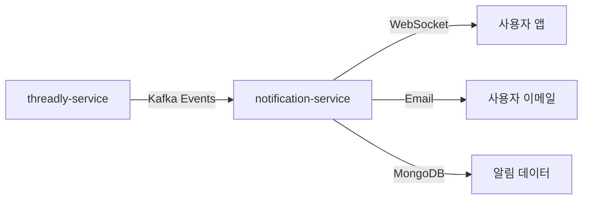
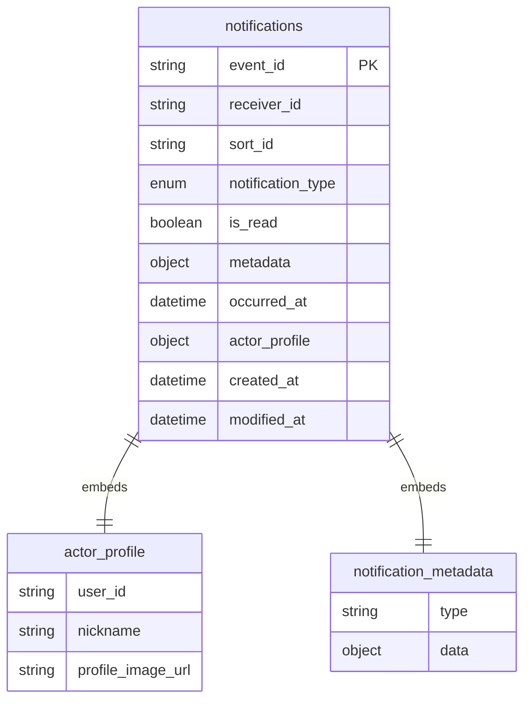
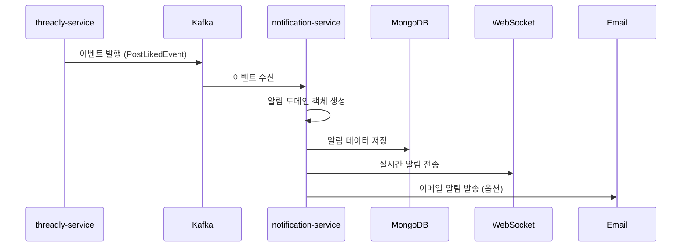

# Notification Service - Threadly MSA 알림 마이크로서비스

## 프로젝트 개요

Notification Service는 Threadly 플랫폼의 MSA 아키텍처에서 알림 기능을 담당하는 전용 마이크로서비스입니다. 실시간 푸시 알림, 이메일 알림, 웹소켓 기반 즉시 알림을 통해 사용자들에게 다양한 상호작용 이벤트를 전달합니다.

### 주요 기능
- **실시간 알림**: WebSocket을 통한 즉시 알림 전달
- **이메일 알림**: SMTP를 통한 이메일 발송
- **다양한 알림 타입**: 좋아요, 댓글, 팔로우, 팔로우 요청 등
- **알림 이력 관리**: MongoDB 기반 알림 데이터 저장 및 조회
- **Kafka 통합**: 다른 마이크로서비스로부터 이벤트 수신
- **읽음 상태 관리**: 사용자별 알림 읽음/미읽음 상태 추적

### Threadly MSA 생태계에서의 역할


## 기술 스택

### Backend
- **언어**: Java 17
- **프레임워크**: Spring Boot 3.x, Spring WebSocket
- **빌드 도구**: Gradle (Kotlin DSL)
- **의존성 관리**: Spring Dependency Management, Line Recipe Plugin

### 데이터베이스
- **주 데이터베이스**: MongoDB (NoSQL)
- **캐시**: Redis (세션 관리, 임시 데이터)

### 메시징 및 통신
- **메시지 브로커**: Apache Kafka (이벤트 수신)
- **실시간 통신**: WebSocket (즉시 알림)
- **이메일**: SMTP (Gmail, AWS SES 등)

### CI/CD 및 배포
- **CI/CD**: GitHub Actions
- **컨테이너화**: Docker
- **배포 전략**: Blue-Green 무중단 배포

### 모니터링
- **로깅**: Structured Logging with Logback
- **메트릭**: Spring Boot Actuator

## 아키텍처

### 헥사고날 아키텍처 (Clean Architecture)

```
┌─────────────────────────────────────────────────────────────┐
│                        Application Layer                     │
│  ┌─────────────────┐                                        │
│  │    app-api      │  REST API & WebSocket 엔드포인트       │
│  │  (Notification  │  실시간 알림 전달                       │
│  │     API)        │                                        │
│  └─────────────────┘                                        │
└─────────────────────────────────────────────────────────────┘
                                │
┌─────────────────────────────────────────────────────────────┐
│                         Adapter Layer                       │
│  ┌─────────────────┐  ┌─────────────────┐  ┌─────────────┐  │
│  │adapter-kafka    │  │adapter-persistence│ │adapter-redis│  │
│  │(이벤트 수신)     │  │   (MongoDB)      │  │   (캐시)    │  │
│  └─────────────────┘  └─────────────────┘  └─────────────┘  │
│  ┌─────────────────┐  ┌─────────────────┐                  │
│  │ adapter-smtp    │  │adapter-websocket │                  │
│  │ (이메일 발송)    │  │ (실시간 알림)    │                  │
│  └─────────────────┘  └─────────────────┘                  │
└─────────────────────────────────────────────────────────────┘
                                │
┌─────────────────────────────────────────────────────────────┐
│                          Core Layer                         │
│  ┌─────────────────┐  ┌─────────────────┐  ┌─────────────┐  │
│  │  core-domain    │  │  core-service   │  │  core-port  │  │
│  │ (Notification   │  │(알림 비즈니스    │  │(포트 인터페이스)│ │
│  │   도메인)       │  │     로직)       │  │             │  │
│  └─────────────────┘  └─────────────────┘  └─────────────┘  │
└─────────────────────────────────────────────────────────────┘
                                │
┌─────────────────────────────────────────────────────────────┐
│                        Commons Layer                        │
│  ┌─────────────────┐                                        │
│  │notification-    │                                        │
│  │   commons       │  공통 유틸리티 및 상수                  │
│  │                 │                                        │
│  └─────────────────┘                                        │
└─────────────────────────────────────────────────────────────┘
```

### 모듈별 역할

#### 1. notification-apps (애플리케이션 계층)
- **app-api**: REST API 및 WebSocket 엔드포인트
  - 알림 조회 API
  - 실시간 알림 WebSocket 연결
  - 알림 읽음 처리 API

#### 2. notification-core (핵심 비즈니스 로직)
- **core-domain**: 알림 도메인 모델
  - Notification 엔티티
  - NotificationType (좋아요, 댓글, 팔로우 등)
  - NotificationMetaData (알림별 상세 정보)
  - ActorProfile (행위자 프로필 정보)
- **core-service**: 알림 서비스 로직
  - 알림 생성 및 발송
  - 알림 조회 및 읽음 처리
  - 사용자별 알림 필터링
- **core-port**: 포트 인터페이스
  - 인바운드/아웃바운드 포트 정의

#### 3. notification-adapters (어댑터 계층)
- **adapter-kafka**: Kafka 이벤트 수신
  - NotificationConsumer (알림 이벤트 처리)
  - MailConsumer (이메일 이벤트 처리)
- **adapter-persistence**: MongoDB 데이터 저장
  - NotificationDoc (MongoDB 문서)
  - 알림 CRUD 작업
- **adapter-redis**: 캐시 및 세션 관리
  - 임시 데이터 저장
  - WebSocket 세션 관리
- **adapter-smtp**: 이메일 발송
  - SMTP 클라이언트
  - 이메일 템플릿 처리
- **adapter-websocket**: 실시간 알림
  - WebSocket 연결 관리
  - 실시간 알림 브로드캐스트

#### 4. notification-commons (공통 모듈)
- 공통 유틸리티
- 예외 처리
- 상수 정의

## 데이터베이스 설계 (MongoDB)

### NoSQL Document 구조



### 주요 컬렉션 설명

#### 1. notifications (알림 메인 컬렉션)
```json
{
  "_id": "event_123",
  "receiver_id": "user_456",
  "sort_id": "ObjectId",
  "notification_type": "POST_LIKE",
  "is_read": false,
  "metadata": {
    "type": "POST_LIKE",
    "post_id": "post_789",
    "post_content": "게시글 내용..."
  },
  "occurred_at": "2025-01-15T10:30:00",
  "actor_profile": {
    "user_id": "user_123",
    "nickname": "김사용자",
    "profile_image_url": "https://..."
  },
  "created_at": "2025-01-15T10:30:00",
  "modified_at": "2025-01-15T10:30:00"
}
```

#### 2. 알림 타입별 메타데이터 구조

##### POST_LIKE (게시글 좋아요)
```json
{
  "type": "POST_LIKE",
  "post_id": "post_123",
  "post_content": "게시글 내용 일부..."
}
```

##### COMMENT_ADDED (댓글 추가)
```json
{
  "type": "COMMENT_ADDED",
  "post_id": "post_123",
  "comment_id": "comment_456",
  "comment_content": "댓글 내용..."
}
```

##### FOLLOW_REQUEST (팔로우 요청)
```json
{
  "type": "FOLLOW_REQUEST",
  "follow_id": "follow_789"
}
```

## 서비스 플로우

### 1. 알림 생성 및 발송 플로우


### 2. 실시간 알림 플로우
```
1. 사용자 앱에서 WebSocket 연결
2. 알림 이벤트 발생 시 즉시 전송
3. 연결이 끊어진 경우 재연결 시 미읽음 알림 전송
```

### 3. 알림 조회 플로우
```
1. 사용자 알림 목록 API 호출
2. MongoDB에서 사용자별 알림 조회
3. 페이지네이션 적용하여 응답
4. 읽음 처리 API로 상태 업데이트
```

## Docker 구성

### 개발 환경 (docker-compose.yml)
```yaml
services:
  mongodb:
    - MongoDB 데이터베이스
    - 포트: 27017
    - 볼륨 마운트: 데이터 영속성
```

### 프로덕션 배포
- **Multi-stage Docker Build**: Java 21 기반
- **Blue-Green 배포**: 무중단 서비스 업데이트
- **헬스체크**: Spring Boot Actuator 연동

## GitHub Actions CI/CD

### CI 워크플로우 (ci.yml)
```yaml
트리거: Pull Request → develop/master 브랜치
프로세스:
1. Java 21 환경 설정
2. Gradle 캐싱 및 빌드
3. MongoDB 테스트 환경 구성
4. 테스트 실행 및 리포트 수집
5. 테스트 환경 정리
```

### CD 워크플로우 (cd.yml)
```yaml
트리거: master 브랜치 푸시
프로세스:
1. Gradle 빌드 및 Docker 이미지 생성
2. Docker Hub에 이미지 푸시
3. AWS EC2에 배포 파일 전송
4. Blue-Green 배포 스크립트 실행
5. 무중단 배포 완료
```

## API 엔드포인트

### REST API
- `GET /api/notifications` - 사용자 알림 목록 조회
- `PUT /api/notifications/{notificationId}/read` - 알림 읽음 처리
- `GET /api/notifications/unread-count` - 미읽음 알림 수 조회
- `DELETE /api/notifications/{notificationId}` - 알림 삭제

### WebSocket
- `/ws/notifications` - 실시간 알림 수신 연결
- 연결 시 인증 토큰 검증
- 사용자별 개별 채널 관리

## 모니터링 및 로깅

### 알림 서비스 전용 메트릭
- **알림 발송량**: 시간별 알림 생성 및 발송 수
- **알림 타입별 통계**: 좋아요, 댓글, 팔로우 등 타입별 분석
- **WebSocket 연결 상태**: 실시간 연결된 사용자 수
- **이메일 발송 성공률**: SMTP 발송 성공/실패 비율
- **MongoDB 성능**: 쿼리 응답 시간 및 인덱스 효율성

### 로깅 전략
- **구조화된 로그**: JSON 형태 로그 출력
- **알림 이벤트 추적**: 이벤트 생성부터 전달까지 전체 플로우
- **에러 로깅**: Kafka 컨슈머 에러, WebSocket 연결 에러 등

## 개발 환경 설정

### 사전 요구사항
- Java 17+
- Docker & Docker Compose
- Gradle

### 로컬 실행
```bash
# 1. MongoDB 시작
cd infra/compose/dev
docker-compose up -d

# 2. 애플리케이션 빌드 및 실행
./gradlew clean build
./gradlew :notification-apps:app-api:bootRun

# 3. WebSocket 테스트
# ws://localhost:8080/ws/notifications 연결
```

### 테스트 실행
```bash
# 단위 테스트
./gradlew test

# 통합 테스트
./gradlew integrationTest
```

## MSA 통신 방식

### 1. 이벤트 기반 통신 (Kafka)
- **threadly-service → notification-service**
- 이벤트 타입: PostLikedEvent, CommentAddedEvent, FollowEvent 등
- 비동기 처리로 느슨한 결합 유지

### 2. 동기 통신 (REST API)
- 필요 시 다른 서비스로부터 사용자 정보 조회
- Circuit Breaker 패턴 적용으로 장애 전파 방지

## 성능 최적화

### 데이터베이스 최적화
- **MongoDB 인덱스**: receiver_id, occurred_at 복합 인덱스
- **TTL 인덱스**: 오래된 알림 자동 삭제
- **읽기 최적화**: 페이지네이션 최적화

### WebSocket 최적화
- **연결 풀 관리**: 사용자별 세션 효율적 관리
- **메시지 큐잉**: 연결 끊김 시 임시 저장
- **부하 분산**: 다중 인스턴스 환경에서 세션 동기화

### 캐시 전략
- **Redis 활용**: 자주 조회되는 알림 데이터 캐싱
- **알림 수 캐싱**: 미읽음 알림 수 실시간 업데이트

## 장애 대응

### 장애 시나리오별 대응
1. **MongoDB 장애**: Redis 캐시로 임시 서비스
2. **Kafka 장애**: 이벤트 큐잉 및 재처리
3. **SMTP 장애**: 재시도 메커니즘 및 대체 서버
4. **WebSocket 장애**: 자동 재연결 및 미전송 알림 보상

### 모니터링 알림
- 알림 발송 실패율 임계치 초과 시 알림
- WebSocket 연결 수 급감 시 알림
- MongoDB 응답 시간 지연 시 알림

## 보안 고려사항

### 인증 및 인가
- JWT 토큰 기반 사용자 인증
- WebSocket 연결 시 토큰 검증
- 사용자별 알림 접근 권한 제어

### 데이터 보안
- 개인정보 최소 수집 원칙
- 알림 내용 암호화 (필요 시)
- 로그에서 민감 정보 마스킹

## 향후 계획

### 기능 확장
- **푸시 알림**: FCM/APNS 연동
- **알림 설정**: 사용자별 알림 수신 설정
- **대량 알림**: 공지사항 등 전체 사용자 알림
- **알림 템플릿**: 다국어 지원 및 개인화

### 기술적 개선
- **이벤트 소싱**: 알림 이벤트 히스토리 관리
- **CQRS 패턴**: 읽기/쓰기 모델 분리
- **GraphQL**: 클라이언트 맞춤 알림 데이터 제공
- **Kubernetes**: 컨테이너 오케스트레이션

### 성능 개선
- **샤딩 전략**: 대용량 사용자 대응
- **읽기 전용 복제본**: 조회 성능 향상
- **CDN 활용**: 프로필 이미지 등 정적 자원

## 기여 가이드

### 개발 프로세스
1. Feature 브랜치 생성
2. 알림 타입 추가 시 메타데이터 구조 정의
3. 테스트 작성 (단위 테스트, 통합 테스트)
4. Pull Request 생성
5. 코드 리뷰 및 머지

### 알림 타입 추가 방법
1. `NotificationType` enum에 새 타입 추가
2. 해당 타입의 `NotificationMetaData` 구현체 생성
3. Kafka 컨슈머에서 이벤트 처리 로직 추가
4. WebSocket 알림 템플릿 작성

---

본 Notification Service는 Threadly 플랫폼의 사용자 경험을 향상시키는 핵심 MSA 컴포넌트로, 확장 가능하고 안정적인 실시간 알림 시스템을 제공합니다.